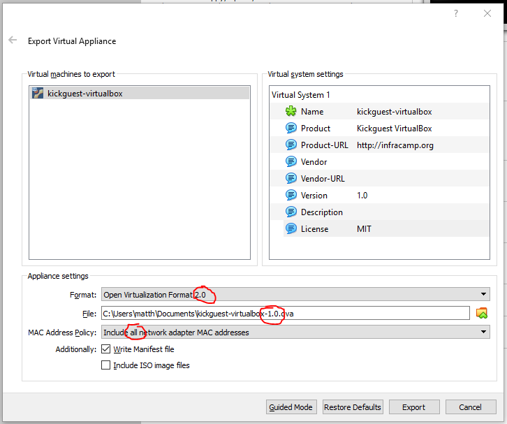

# How to develop this piece of software.

## Virtualbox settings

Set `Documents/Projects` as shared folder `kick_share`


## Manual preparation of creating a new image

Create a new virtual machine using:

- name: `kickguest-virtualbox-0.4`
- Create harddisk: 20 GB Space
- Image disk file type: `VDI` - Dynamically allocated
- Size: 20 GB

Edit Settings and choose ubuntu-18.04 iso as boot medium.

Download the free virtualbox runner and install
ubuntu server using the default image. Select `minimal virtual maschine`,
select `install ssh server`

- Select enp0s3 as primary interface to be configured by dhcp
- Hostname: `kickguest`
- Create a user `user` with password `pass` (the password will be removed later)
- Partition: Use entire disk
- No automatic updates
- Package selection: Install `OpenSSH server`
- Install GRUB bootloader to master boot record: `YES`
- Reboot the system

After installation login to the system (User: user Pass: pass).

- Become root: `sudo bash`
- Install vim `apt install vim`
- Edit `/etc/netplan/01-netcfg.yaml` and add `enp0s8` to `dhcp4: yes`. Safe - reboot.


## The provision script

Then, login to the image using ssh as user `ssh user@local.infracamp.org` and  run this script:


````
sudo apt-get update && sudo apt-get install -y git && cd /tmp/ && sudo git clone https://github.com/infracamp/kickguest-virtualbox.git && sudo bash /tmp/kickguest-virtualbox/provision/install.sh
````

(The Guste-Filesystem utils are hiddin in virtualbox-guest-utils )

Test the system - then

``
rm /home/user/.bash_history
sudo rm /root/.bash_history
``

Wait until `docker ps` is executing correclty (first startup will take some minutes)

## Create Release



Select ``export appliance`` (in 2.0 open virtual maschine format - including manifest.)

## Descision about preinstalled packages

- Why do we need `whois`-Package?

The `mkpasswd`-script is located inside to create strong hashed
passwords. You'll need strongly hashed passwords everywhere in public
cloud infrastructure - so we'll make it easy to create hashes.

- What's about `open-vm-tools`?

This is used to mount the host filesystems into the container.
(Open Source version of VMwares TOOLS)