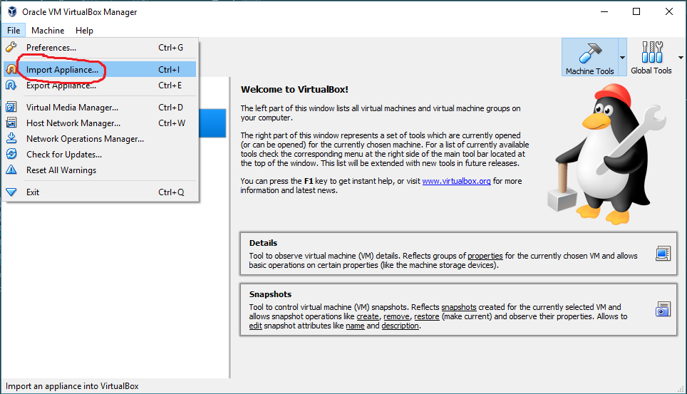
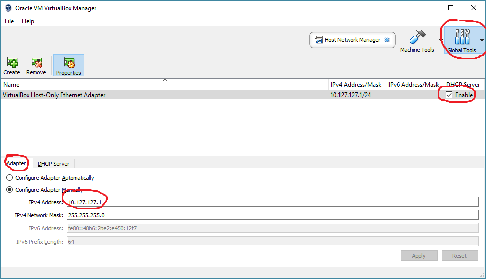
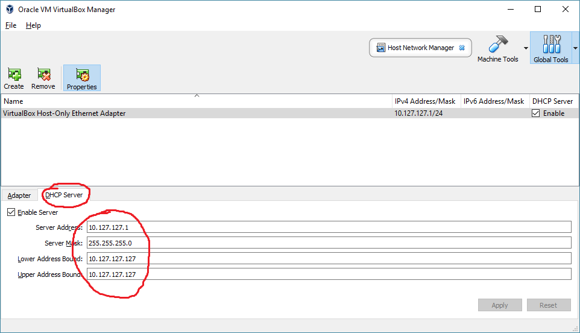
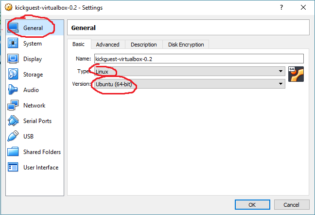
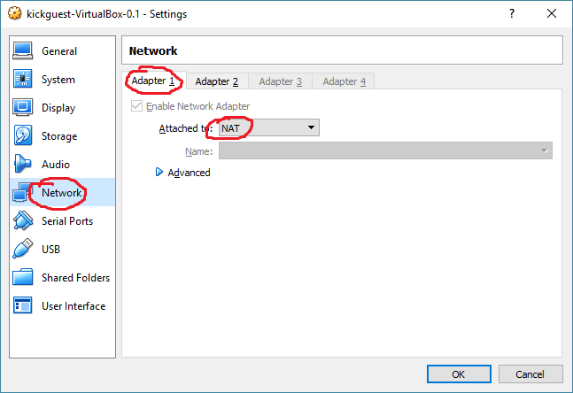
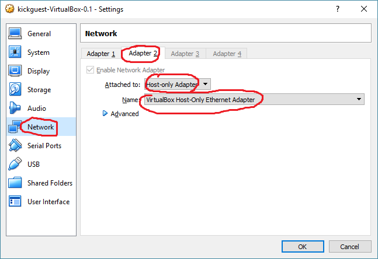
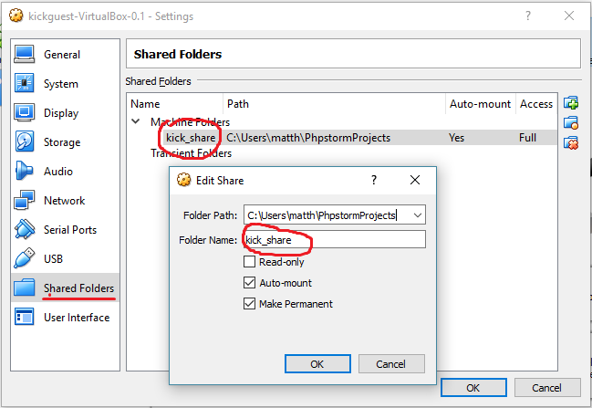
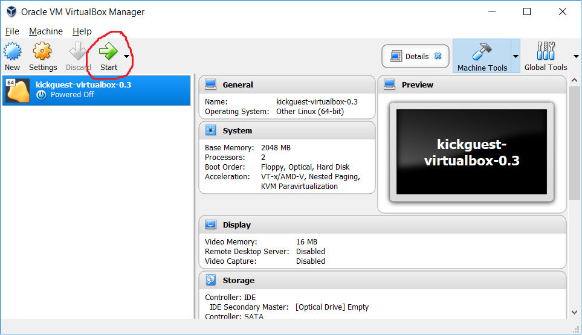

# Kickstart VirtualBox Image

The simplest way to run docker and kickstart on windows 8/10 and macOS.

- [Install VirtualBox](https://www.virtualbox.org/wiki/Downloads)
- [Download latest release](https://github.com/infracamp/kickguest-virtualbox/releases)

## Configuration

### Importing the virtual appliance

After downloading the `.ova`-image, import the virtual machine to your VirtualBox




Second: Create a host-only virtual network adaptor to run with the IP Address `10.127.127.127` *(this private ip
is associated with `local.infracamp.org` and `*.local.infracamp.org`)*:

*Hint: Of course, you can associate any other ip - but you than have to associate a hostname by yourself*




> Please make sure to remove and create a new host-adapter when upgrading kickguest (dhcp issue in virtualbox)

### Configuring the virtual appliance

Open the `settings`-dialog of the newly created machine.

Ensure the machine is configured to `Ubuntu (64-bit)`



Then connect the virtual maschine both with the host **and** the NAT bridge. 




Finally map **YOUR** *Projects* Path to the shared folder name `kick_share`.



***Restart Windows!***

Start the virtual machine: 


## Log into to the system

```ssh user@local.infracamp.org``` or `ssh user@10.127.127.127`

Or in your browser (only from your local computer)

```http://local.infracamp.org``` (only when you run a http-based container)

## Run the image

The image will start and:

- Create a ssh private/public key pair in `sharedFolder/.ssh/` (if not already existing)


## FAQ / Debugging

- Try to ping 10.127.127.1 from inside container. If it fails, maybe you'll have to
  restart your computer. (Windows need restart for adapter-canges to take effect)
  
- Nothing is is `/mnt`: Is your shared-folder named `kick_share` and active?

- The machine won't boot:
    - Are virtualisation CPU features turned on in your bios?
      (VirtualBox will throw an exception)
    - Is machine vm-type set "Ubuntu" and version to "Ubuntu (64-bit)"?
      (Otherwise system will hang after grub bootloader)
