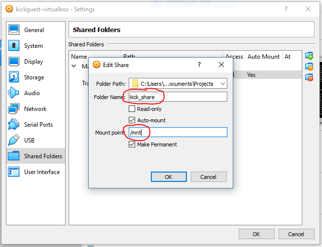

# Kickstart VirtualBox Image

The simplest way to run docker and kickstart on windows 8/10 and macOS.

- [Install VirtualBox](https://www.virtualbox.org/wiki/Downloads)
- [Download latest release](https://github.com/infracamp/kickguest-virtualbox/releases)

## Configuration

Map you *Projects* Path to a shared folder with name `kick_share`.

## Run the image

The image will start and:

- Create a ssh private/public key pair in `sharedFolder/.ssh/` (if not already existing)

